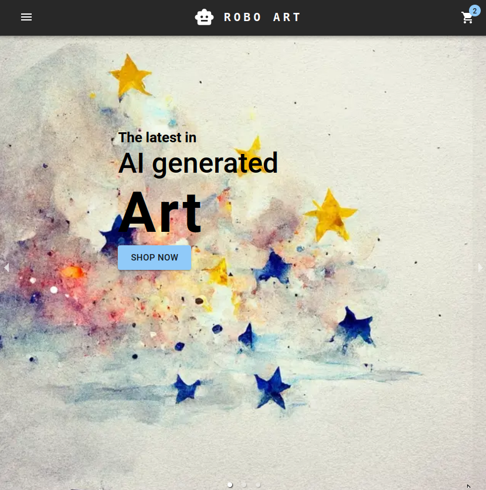

 # Store Frontend (Shopping Cart)

An e-commerce frontend built with React, React Router & MUI (Emotion). Tested with Vitest & Testing Library.

[Demo here](https://casshopfrontend.netlify.app//)



### Installing and running locally

```bash
git clone git@github.com:Casssb/shopping-cart.git
cd shopping-cart
npm install
npm run dev
```

## Tech Used
* React, React Router & Material UI (customised with Emotion)
* NPM & Vite for build
* Vitest (test runner) & React Testing Library for testing
* Proptypes library for type safety
* React Responsive Carousel
* SWC for compiling

## Features
* Fully interactive cart built using React context & the useReducer hook
* All context state data is cached using useMemo
* All images in WebP format and compressed for faster loading
* Simple dark-mode styling
* Responsive on PC, Tablet & Mobile

## Thoughts
I think I may have learnt more on this project than the last 2-3 put together! Rather than write my general thoughts here's a quick summary of each of the main techs I used;
* MUI - This was great! The docs are amazing and IMO it strikes a perfect balance of having non-offensive, useable components and making them infinitely customisable. Adapting the theme (using context) & hooking in custom CSS (via the SX prop / Emotion) made everything super smooth.
* React Router- I'd already used this a fair bit but using the older methods of setting up routes (using the BrowserRouter React component). After spending many hours reading their (also amazing) docs I discovered their functional hooks (useParams & useNavigate) which made routing my app a breeze. Since very few guides (or discussions on Stack) use the newer way (as of version 6.6) of setting up a router I did struggle a little with testing.
* React Testing Library (with Vitest)- Which brings me to testing. I read tons & tons about the benefits of red/green practices and CI/CD. I can certainly see the benefit of this when it comes to revisiting code after a long period of time or switching projects between different team members. It was also very helpful having the tests running in the background and reminding me of the effect changes were having on the app overall. 

## Possible Improvements
* I think the main lesson I've learnt from all of the testing I did is that some of my components are structured in such a way that makes testing very difficult (and therefore are probably not written well). I'll continue reading up on best practices and try to make improvements.
* Having most state in a single store and passing this down via context (using the useContext hook) was probably overkill for this app and only really made the testing harder. I did this simply to learn it, but if I was re-doing the app to be better structured I don't think a context provider was required (in the worst case props only ever needed to be drilled down 2 levels).
* I've read a lot about header-less CMS providers like Strapi and I'd like to serve all my data using something like this. Would be nice to add authentication (maybe using something like Firebase) and I think I'll come back and add this in the future.
* I ended up using PropTypes for type safety but in reality this wasn't very useful. My app only had 3 instances of props being passed in the traditional way (I mostly used a context provider with the useContext hook). In future I'm planning to use Typescript as it seems much more adaptable and comprehensive.

## Credits
* All art created directly by [Midjourney](https://midjourney.com/home/?callbackUrl=%2Fapp%2F) or [Stable Diffusion](https://stablediffusionweb.com/) (or taken from [OpenArt](https://openart.ai/) but still made by Midjourney or Stable Diffusion)